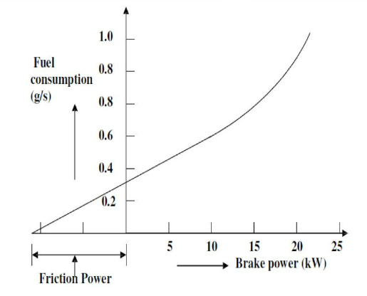

OBJECTIVE :
(AIM)

STEPS:
1. When you click on the "performance of single cylinder four stroke engine" file a window will open as shown.

2. Click on the NEXT button to move  to the next step.

3. Click on the arrow to check the length of fuel.

4. Click on the arrow to open the valve for water flow.

5. Click on the valve of ENGINE ROTAMETER to adjust the flow of water.

6. Click on the valve of CALORIMETER ROTAMETER to adjust the flow of water.

7. Click on the arrow to adjust the dynamometer at minimum position.

8. Click on tha arrow to change the fuel cock position from TANK to MEASURING.

9. Click on the arrow to start the engine by handcranckling.

10. Click on the NEXT button to move to the next steps.

11. Click on the arrow to dynamometer to adjust the load to 3kg

12. Click on the arrow to change fuel cock position from MEASURING to TANK.

13. Click on the arrow to change to fuel cock position to TANK to MEASURING.

14. Click on the temperature indicator to note down the temperatures.

15. Click on the NEXT button to move to the next steps.

16. Calculate the BP and TFC using the observations displayed and enter the values.

17. A graph is plotted using the calculated values.

18. Calculate the IP, BMEP, Mechanical Efficiency, Indicator Efficiency, Brake efficiency and enter the values.

19. From the calculated values a graph is plotted which comparies Mechanical efficiency ,indicator efficiency ,brake efficiency and click on restart button if you want to repeat the experiment.

