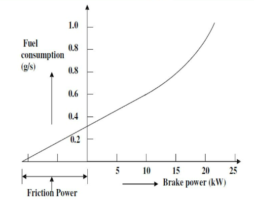

The performance analysis of a single-cylinder four-stroke diesel engine is conducted for several essential reasons. Firstly, evaluating the engine's performance allows engineers to assess its efficiency in converting fuel energy into useful mechanical work. This analysis is crucial for identifying areas of improvement and optimizing the engine's operation to achieve better fuel economy and overall efficiency.

Secondly, performance testing helps determine the engine's actual power output, which is of paramount importance for various applications. Whether it's selecting the right engine for specific machinery or vehicles or determining the power capacity of a generator, knowing the engine's power output is essential.

Additionally, performance analysis provides insights into the engine's emissions and combustion characteristics. By understanding emissions levels, engineers can develop strategies to reduce harmful pollutants and comply with environmental regulations, contributing to cleaner and more sustainable operations.

The performance of a single-cylinder four-stroke diesel engine can be thoroughly evaluated using various parameters, including brake efficiency, indicated power, brake power, specific fuel consumption, IMEP, BMEP, total fuel consumption, mechanical efficiency, brake thermal efficiency, indicated thermal efficiency, volumetric efficiency, Williams line (BP and TFC), and heat balance sheet. Let's explore each of these parameters and their significance in assessing engine performance:

1. Brake Power:
   Brake Power is the actual power output of the engine measured at the engine's output shaft. It is determined by a dynamometer connected to the engine's crankshaft.
   BP=(2 x 3.14 xN xT)/60 x 1000

2. Indicated Power:
   Indicated Power (IP) represents the power produced during the engine's cycles. It is the theoretical power generated by the combustion process in the cylinder and is measured using an engine dynamometer. Indicated Power can be calculated using the formula:
   Indicated Power = (IMEP × Swept Volume × Engine Speed) / 2π
   IMEP is the Indicated Mean Effective Pressure, and the swept volume represents the volume displaced by the piston during one stroke.

3. Frictional Power:
   Frictional power represents the mechanical losses due to friction within the engine. It is the difference between the indicated power and the brake power and represents the power losses not converted into useful work

4. Brake Efficiency:
   Brake Efficiency measures how efficiently the engine converts the energy released during combustion into useful work at the engine's output shaft. It is expressed as a percentage and is calculated using the formula:
   Brake Efficiency = (Brake Power / Indicated Power) × 100
   A higher brake efficiency indicates a more effective conversion of fuel energy into useful work.

5. Specific Fuel Consumption (SFC):
   Specific Fuel Consumption is the amount of fuel consumed by the engine per unit of power produced. It is typically expressed in units of fuel mass consumed per unit of power output (e.g., kg/kWh or g/kWh). Lower SFC values indicate better fuel efficiency.
   Specific Fuel Consumption = (Fuel Consumption / Brake Power)

6. Indicated Mean Effective Pressure (IMEP):
   IMEP is the average pressure that would produce the same amount of indicated work as the actual pressure in the combustion chamber during the engine's cycles. It is calculated by dividing the indicated work by the swept volume during one cycle.
   IMEP = (Indicated Work / Swept Volume)

7. Brake Mean Effective Pressure (BMEP):
   BMEP is similar to IMEP but is based on the actual brake power delivered by the engine at the output shaft. It is an essential parameter for comparing the performance of different engines.
   BMEP = (Brake Power / Swept Volume)

8. Total Fuel Consumption:
   Total Fuel Consumption is the total amount of fuel consumed by the engine over a specific period, typically expressed in liters or gallons.
   TFC= (25 x S x3600)/1000 x t

9. Mechanical Efficiency:
   Mechanical Efficiency is the ratio of brake power (output power) to indicated power (power produced during the engine's cycles). It accounts for mechanical losses due to friction and other factors.
   Mechanical Efficiency = (Brake Power / Indicated Power) × 100

10. Brake Thermal Efficiency:
   Brake Thermal Efficiency measures the engine's efficiency in converting the energy in the fuel into useful work at the output shaft. It is expressed as a percentage and can be calculated using the formula:
   Brake Thermal Efficiency = (BP x 3600)/(TFC x CV)

11. Indicated Thermal Efficiency:
    Indicated Thermal Efficiency represents the engine's efficiency in converting the energy released during combustion into indicated power. It is expressed as a percentage and can be calculated using the formula:
    Indicated Thermal Efficiency = (IP x 3600)/(TFC x CV)

12. Volumetric Efficiency:
    Volumetric Efficiency measures the engine's ability to draw in a fresh air-fuel mixture into the cylinder during the intake stroke compared to the theoretical maximum volume of air that the cylinder can hold. It is expressed as a percentage and can be calculated using the formula:
    Volumetric Efficiency = (Actual Air Mass / Theoretical Air Mass) × 100

13. Willians Line (Brake Power and Total Fuel Consumption):
    The Williams line is a graphical representation of engine performance in terms of brake power (BP) and total fuel consumption (TFC). It helps determine the most efficient operating points of the engine by identifying the combination of power and fuel consumption that results in the best efficiency.
    

14. Heat Balance Sheet:
    A heat balance sheet provides a comprehensive analysis of energy flow within the engine. It accounts for the heat absorbed by the engine, the heat utilized for useful work (brake power), and the heat lost through various avenues (exhaust, cooling, radiation, etc.). It helps identify areas for improving efficiency and reducing heat losses, allowing for better engine performance and optimization.

Analyzing these parameters, Williams line (BP and TFC), and heat balance sheet provides a comprehensive understanding of the engine's performance, efficiency, and potential areas for optimization and improvement. Engine designers, researchers, and operators use this data to fine-tune engine operations and achieve the desired balance between power, efficiency, and emissions.
